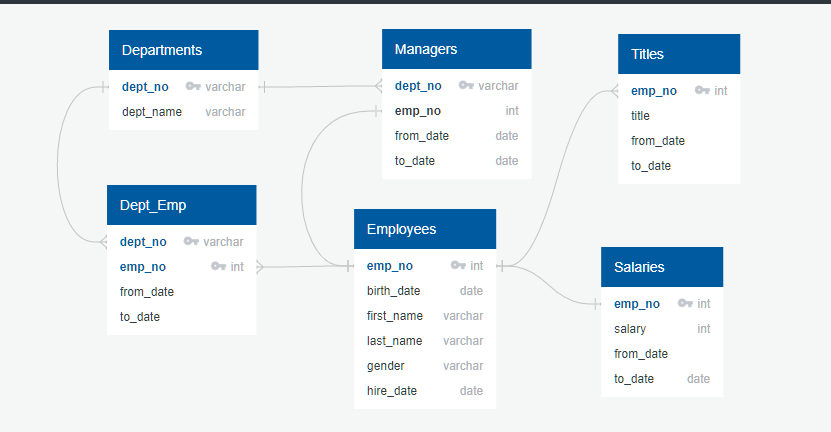
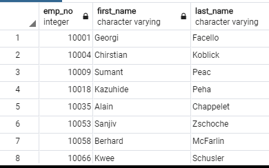
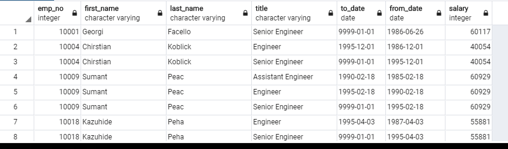
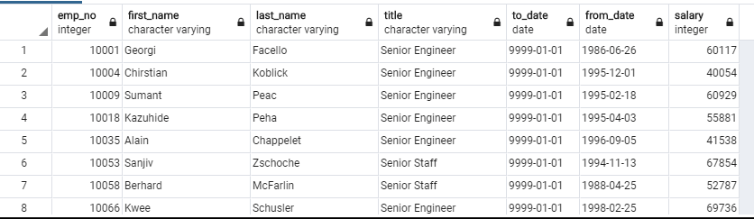
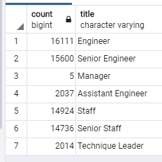

# Pewlett_Hackard_Analysis
First step was to download the excel files from Pewlett Hackard and creat and ERD showing the relationships between the databases. 
Here is the code for the ERD:
Departments
-
dept_no varchar pk
dept_name varchar

Employees
-
emp_no pk int
birth_date date
first_name varchar
last_name varchar
gender varchar
hire_date date

Salaries
-
emp_no int pk fk - Employees.emp_no
salary int
from_date
to_date date

Managers
-
dept_no varchar pk fk >- Departments.dept_no
emp_no int fk - Employees.emp_no
from_date date
to_date date

Dept_Emp
-
dept_no varchar pk fk >- Departments.dept_no
emp_no int pk fk >- Employees.emp_no
from_date
to_date

Titles
-
emp_no int pk fk >- Employees.emp_no
title
from_date
to_date

Here is the image:

Next tables were created in SQL and the data was imported to the table from the excel sheets. Here is the code for those tables:
-- Creating tables for PH-EmployeeDB
CREATE TABLE departments (
     dept_no VARCHAR(4) NOT NULL,
     dept_name VARCHAR(40) NOT NULL,
     PRIMARY KEY (dept_no),
     UNIQUE (dept_name)
);

CREATE TABLE employees (
	emp_no INT NOT NULL,
     birth_date DATE NOT NULL,
     first_name VARCHAR NOT NULL,
     last_name VARCHAR NOT NULL,
     gender VARCHAR NOT NULL,
     hire_date DATE NOT NULL,
     PRIMARY KEY (emp_no)
);

CREATE TABLE dept_manager (
	dept_no VARCHAR(4) NOT NULL,
	emp_no INT NOT NULL,
	from_date DATE NOT NULL,
	to_date DATE NOT NULL,
FOREIGN KEY (emp_no) REFERENCES employees (emp_no),
FOREIGN KEY (dept_no) REFERENCES departments (dept_no),
	PRIMARY KEY (emp_no, dept_no)
);

CREATE TABLE salaries (
  emp_no VARCHAR NOT NULL,
  salary INT NOT NULL,
  from_date DATE NOT NULL,
  to_date DATE NOT NULL,
  FOREIGN KEY (emp_no) REFERENCES employees (emp_no),
  PRIMARY KEY (emp_no)
);

CREATE TABLE Dept_Emp (
	emp_no INT NOT NULL,
	dept_no VARCHAR NOT NULL,
	from_date DATE NOT NULL,
	to_date DATE NOT NULL,
FOREIGN KEY (dept_no) REFERENCES departments (dept_no),
FOREIGN KEY (emp_no) REFERENCES employees (emp_no),
	PRIMARY KEY (dept_no, emp_no)
);

CREATE TABLE Titles (
	emp_no INT NOT NULL,
	title VARCHAR NOT NULL,
	from_date DATE NOT NULL,
	to_date DATE NOT NULL,
FOREIGN KEY (emp_no) REFERENCES employees (emp_no),
	PRIMARY KEY (emp_no)
);

Next we made a new table called retirement_info2. Using this code:
SELECT emp_no, first_name, last_name
INTO retirement_info2
FROM employees
WHERE (birth_date BETWEEN '1952-01-01' AND '1955-12-31')
AND (hire_date BETWEEN '1985-01-01' AND '1988-12-31');

Example of retirement_info:

Technical Analysis Deliverable 1:
Using the retirement_info2, titles, and salaries table the retire_by_title table was generated using this code:
--MAKE TABLE THAT HAS NAMES, TITLES, DATE, SALARIES OF RETIREES
select ri2.emp_no,
		ri2.first_name,
		ri2.last_name,
		titles.title,
		titles.to_date,
		titles.from_date,
		salaries.salary
INTO retire_by_title
FROM retirement_info as ri2
LEFT JOIN salaries
    ON (ri2.emp_no = salaries.emp_no)
LEFT JOIN titles
	ON (ri2.emp_no = titles.emp_no)

Example of retire_by_title

We had problem with duplicates. In order to remove the duplicates I used this code:

--elimate duplicates in 'retire_by_title' table
SELECT * 
INTO retire_by_title2
FROM retire_by_title
WHERE to_date='9999-01-01'

Here is an example of the new retire_by_title2 with no duplicates:

A tabel containing the number of employees about to retire grouped by job title was requested. I used this code:
--number of employees who are about to retire grouped by title
SELECT COUNT(emp_no), title
INTO num_retire_title
FROM retire_by_title
GROUP BY title

To make this table:

